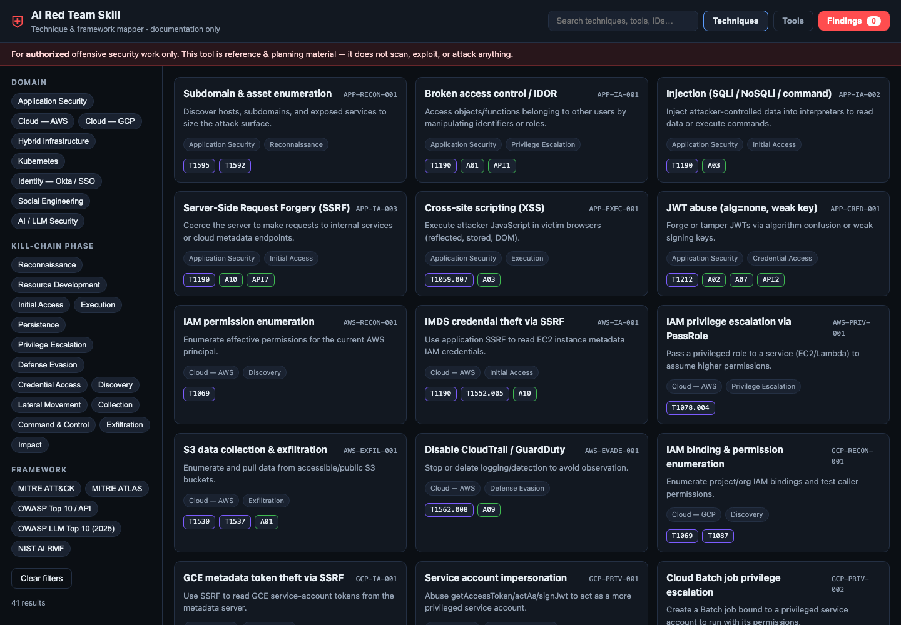

# AI Red Team Skill

[](LICENSE)
[](#responsible-use)
[](#frameworks--standards-referenced)
[](#usage)

> A lightweight, framework-mapped **offensive-security knowledge base** and
> planning assistant for authorized red team engagements — plus a dependency-free
> **web UI** for mapping techniques to MITRE, OWASP, and NIST frameworks.

**Documentation & planning only.** This project does **not** scan, exploit, or
attack anything. It is a reference + UI you share with security engineers to
plan engagements and write findings consistently.



## Contents

- [What's inside](#whats-inside)
- [Two ways to use it](#two-ways-to-use-it)
- [Deployment](#deployment)
- [Usage](#usage)
- [Configuration](#configuration)
- [Repository layout](#repository-layout)
- [Frameworks & standards referenced](#frameworks--standards-referenced)
- [Responsible use](#responsible-use)
- [Contributing](#contributing)
- [License](#license)

---

## What's inside

| Area | Coverage |
|------|----------|
| **AI Red Team methodology** | Engineer role, approach, AI/attacker models used, tooling, workflow |
| **Application Security** | Web, API, mobile, auth, injection, SSRF, deserialization |
| **Cloud — AWS** | IAM, S3, STS, Lambda, EKS, metadata abuse, privesc |
| **Cloud — GCP** | IAM, service accounts, GCS, GKE, metadata, privesc |
| **Hybrid Infrastructure** | AD↔cloud trust, pivoting, BloodHound attack paths |
| **Kubernetes** | RBAC, pod escapes, secrets, supply chain |
| **Identity — Okta / SSO** | SAML/OIDC abuse, MFA fatigue, session theft, IdP federation |
| **Social Engineering** | Vishing, phishing, pretexting, malicious chatbots |
| **AI / LLM Security** | Prompt injection, jailbreaks, RAG poisoning, agent/tool abuse |

Every technique is mapped to **MITRE ATT&CK**, **MITRE ATLAS**, **OWASP Top 10**,
**OWASP LLM Top 10 (2025)**, and **NIST AI RMF**, and ships with a **recommendation**
and **credible reference**.

**Start with the methodology:** [`domains/ai-red-team-engineer.md`](domains/ai-red-team-engineer.md)
explains the AI Red Team engineer's approach, the AI systems and attacker models
used, the tooling stack, and the engagement workflow. To author or extend the
skill, see [`guides/authoring-skills.md`](guides/authoring-skills.md).

---

## Two ways to use it

### 1. As an AI agent Skill
Point your agent at this folder. `SKILL.md` is a **lightweight router** — the
agent loads only the domain/framework file it needs, keeping token usage low
(progressive disclosure). Works in any IDE or agent runtime that supports
skills or simple file-based context.

### 2. As a standalone mapping UI
A zero-build static web app in `ui/` lets engineers browse, filter, and map
techniques to frameworks, then export a findings draft. Reads `data/*.json`.

---

## Deployment

Pick any option — the app is a static site, so anything that serves files works.

### Local (no dependencies)
**Fastest** — one command that starts the server and opens the UI:
```bash
./serve.sh            # macOS / Linux   (./serve.sh 9000 to change port)
./serve.ps1           # Windows (PowerShell)
```
Or run it manually:
```bash
# Python 3 (preinstalled on macOS/Linux; on Windows use "py -m")
cd ai-redteam-skill
python3 -m http.server 8080
# open http://localhost:8080/ui/
```
> Serve from the repo root and open the `/ui/` path so the app can load
> `data/*.json`. Docker/Compose/K8s serve the UI at the root (`/`).

### Docker
```bash
cd ai-redteam-skill
docker build -t ai-redteam-skill -f deploy/Dockerfile .
docker run --rm -p 8080:80 ai-redteam-skill
# open http://localhost:8080
```

### Docker Compose
```bash
cd ai-redteam-skill/deploy
docker compose up --build
```

### Kubernetes
```bash
kubectl apply -f deploy/k8s-deployment.yaml
kubectl port-forward svc/ai-redteam-skill 8080:80
```

See [`deploy/README.md`](deploy/README.md) for details and Windows notes.

---

## Usage

### As an AI agent skill
1. Add this folder to your agent's workspace or skills directory.
2. The agent reads `SKILL.md` (a router) and loads only the domain or framework
   file relevant to the task, keeping context small.
3. Ask it to plan/scope an engagement or write a finding. Each item is mapped to
   MITRE ATT&CK / ATLAS, OWASP, and NIST AI RMF and ships with a recommendation
   and a credible reference.

Start with the methodology in [`domains/ai-red-team-engineer.md`](domains/ai-red-team-engineer.md).

### As a mapping UI
1. Serve the app (see [Deployment](#deployment)) and open it in a browser.
2. **Filter** by domain, kill-chain phase, or framework — or **search** by name,
   ID, tool, or framework tag (e.g. `T1190`, `LLM01`, `SSRF`).
3. Click a technique to open its detail: full framework mapping, recommended
   tools, the recommendation, and reference links.
4. Click **Add to findings** on the techniques you care about.
5. Open **Findings → Export Markdown** to download a findings draft built from
   the standard template, then fill in severity, evidence (defanged), and status.

> Findings live only in your browser's `localStorage`. There is no backend and
> nothing is uploaded anywhere.

---

## Configuration

The app is static and reads three JSON files in `data/` — the single source of
truth that also powers the UI. No build step, environment variables, or database.

**Change the port**
- Local: `python3 -m http.server 9000` then open `http://localhost:9000/ui/`.
- Docker: `docker run --rm -p 9000:80 ai-redteam-skill` then `http://localhost:9000`.
- Compose: edit the `ports` mapping in `deploy/docker-compose.yml`.

**Add or edit techniques / tools** — edit `data/techniques.json` and
`data/tools.json`, then validate:
```bash
for f in data/*.json; do python3 -m json.tool "$f" >/dev/null && echo "OK $f"; done
```
The UI updates on refresh. Field rules and the full schema are documented in
[`guides/authoring-skills.md`](guides/authoring-skills.md).

**Add a domain, phase, framework, or reference link** — edit `data/mappings.json`
(domains, phases, frameworks, and the `references` URL map). New reference keys
should also be added to [`recommendations/references.md`](recommendations/references.md).

**Security headers / CSP** — container deployments use `deploy/nginx.conf`, which
sets a strict same-origin Content-Security-Policy. Adjust it there if you serve
the app behind a reverse proxy or under a sub-path.

---

## Repository layout

```
ai-redteam-skill/
├── SKILL.md                  # Lightweight router (agent entry point)
├── README.md
├── SECURITY.md               # Ethical-use & responsible-disclosure policy
├── CONTRIBUTING.md
├── CHANGELOG.md
├── LICENSE
├── serve.sh / serve.ps1      # One-command local launcher (macOS·Linux / Windows)
├── domains/                  # Methodology + offensive technique references
│   ├── ai-red-team-engineer.md   # AI Red Team engineer: approach, models, workflow
│   ├── application-security.md
│   ├── cloud-aws.md
│   ├── cloud-gcp.md
│   ├── hybrid-infrastructure.md
│   ├── kubernetes.md
│   ├── identity-okta.md
│   ├── social-engineering.md
│   └── ai-llm-security.md
├── frameworks/               # MITRE / OWASP / NIST references + crosswalk
│   ├── mitre-attack.md
│   ├── mitre-atlas.md
│   ├── owasp-top10.md
│   ├── owasp-llm-top10.md
│   ├── nist-ai-rmf.md
│   └── mapping-matrix.md
├── recommendations/          # Remediation playbook + references
│   ├── remediation-playbook.md
│   └── references.md
├── guides/                   # How-to guides
│   └── authoring-skills.md   # Write agent skills + technique playbooks
├── data/                     # Structured JSON (source of truth + UI feed)
│   ├── techniques.json
│   ├── tools.json
│   └── mappings.json
├── deploy/                   # Docker / Compose / K8s / nginx
│   ├── Dockerfile
│   ├── docker-compose.yml
│   ├── k8s-deployment.yaml
│   ├── nginx.conf
│   └── README.md
├── docs/                     # Screenshots & images
│   └── screenshot.png
└── .github/
    └── workflows/
        └── validate.yml      # CI: validate JSON + JS syntax
```

---

## Frameworks & standards referenced

- [MITRE ATT&CK](https://attack.mitre.org/)
- [MITRE ATLAS](https://atlas.mitre.org/) (adversarial threats to AI systems)
- [OWASP Top 10](https://owasp.org/Top10/)
- [OWASP Top 10 for LLM Applications (2025)](https://genai.owasp.org/llm-top-10/)
- [OWASP GenAI Red Teaming Guide](https://genai.owasp.org/)
- [NIST AI Risk Management Framework (AI RMF 1.0)](https://www.nist.gov/itl/ai-risk-management-framework)
- [Microsoft AI Red Team](https://learn.microsoft.com/en-us/security/ai-red-team/)

Tooling ecosystems referenced (links in `recommendations/references.md`):
[Kali tools](https://www.kali.org/tools/), [BloodHound](https://github.com/SpecterOps/BloodHound),
[Promptfoo](https://www.promptfoo.dev/), [NIST Dioptra](https://github.com/usnistgov/dioptra),
[NVIDIA Garak](https://github.com/NVIDIA/garak), [Microsoft PyRIT](https://github.com/Azure/PyRIT),
[deepteam](https://github.com/confident-ai/deepteam).

---

## Responsible use

This material is for **authorized, ethical, offensive security work** —
penetration tests, red team engagements, and AI assurance — conducted with
explicit written permission. Misuse against systems you do not own or lack
authorization to test may be illegal. Contributors and maintainers assume no
liability for misuse. See [`SECURITY.md`](SECURITY.md) for the ethical-use policy
and [`CONTRIBUTING.md`](CONTRIBUTING.md) for contribution rules.

## Contributing

Contributions that add techniques, tools, framework mappings, or fixes are
welcome. Keep entries **documentation-only**, defanged, sourced, and free of any
secrets or organization-specific data. See [`CONTRIBUTING.md`](CONTRIBUTING.md)
and [`guides/authoring-skills.md`](guides/authoring-skills.md), then validate with
`for f in data/*.json; do python3 -m json.tool "$f" >/dev/null; done`.

## License

[MIT](LICENSE) © AI Red Team Skill contributors
